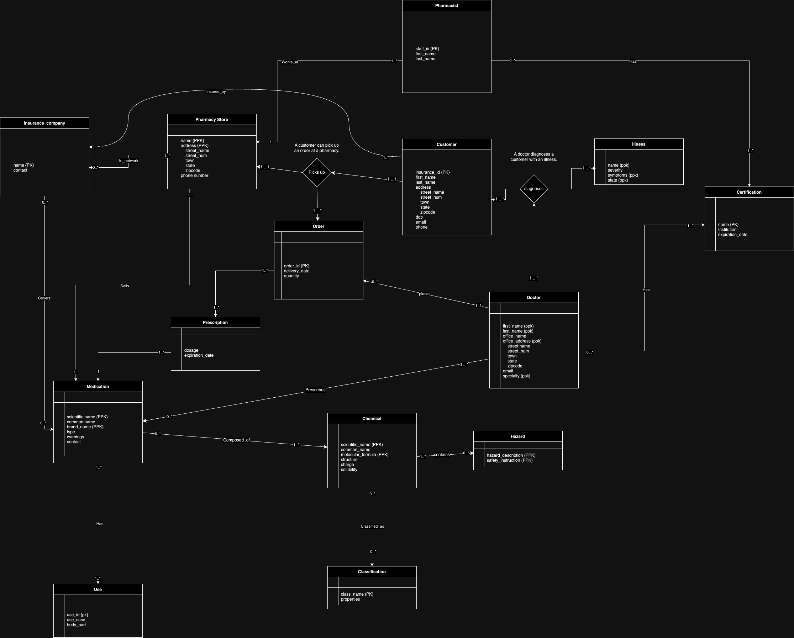

# Final Project Report

**Project Title:** Chemical Database Management System

**Team Members:**
- Khushi Neema
- Natasha Nicholas
- Shane Nicholas

---

## Table of Contents

1. [Introduction](#introduction)
2. [Project Overview](#project-overview)
3. [System Design](#system-design)
   - [Database Schema](#database-schema)
   - [ER Diagram](#er-diagram)
4. [Implementation](#implementation)
   - [Technologies Used](#technologies-used)
   - [Application Structure](#application-structure)
5. [Features](#features)
   - [User Authentication](#user-authentication)
   - [Customer Management](#customer-management)
   - [Doctor Management](#doctor-management)
   - [Medication Management](#medication-management)
   - [Pharmacy Management](#pharmacy-management)
   - [Order Management](#order-management)
6. [Testing](#testing)
7. [Conclusion](#conclusion)
8. [README](#readme)
   - [Prerequisites](#prerequisites)
   - [Installation](#installation)
   - [Running the Application](#running-the-application)
   - [Project Structure](#project-structure)
   - [Dependencies](#dependencies)
   - [Usage](#usage)

---

## Introduction

The Chemical Database Management System is designed to manage and streamline the operations related to pharmaceuticals, customers, doctors, and orders within a pharmacy context. This system provides an interface for administrators to manage customers, doctors, medications, and pharmacies, as well as handle orders and prescriptions.

---

## Project Overview

The primary goal of this project is to develop a web-based application that interacts with a MySQL database to perform CRUD (Create, Read, Update, Delete) operations on pharmaceutical data. The application allows users to:

- View and manage customer information.
- View and manage doctor information, including certifications.
- View detailed information about medications, including their chemical components and hazards.
- Modify pharmacy information for specific orders.
- Delete customer records along with associated data, ensuring data integrity through the use of triggers.

---

## System Design

### Database Schema

The database is named `chemical_database` and contains several tables:

- `customer`
- `doctor`
- `medication`
- `pharmacy_store`
- `pharmacist`
- `orders`
- `prescription`
- `contains`
- `picks_up`
- `diagnoses`
- `illness`
- `certification`
- `obtains_doctor`
- `obtains_pharmacist`
- `chemical`
- `hazard`
- `hazardous`
- `uses`
- `used_for`
- `composed_of`
- `sells`
- `composed_of`
- `in_network`
- `covers`

**Key Relationships:**

- **Customers** pickups **orders** that contain **prescriptions**.
- **Doctors** write **prescriptions** and have **certifications**.
- **Medications** are composed of **chemicals**, which may have associated **hazards**.
- **Pharmacists** work at **pharmacy store** and have **certifications**.

### ER Diagram


----

## Implementation

### Technologies Used

- **Python 3.x**
- **Flask**: A micro web framework for Python.
- **MySQL**: An open-source relational database management system.
- **MySQL Connector/Python**: For connecting Python applications to MySQL databases.
- **HTML/CSS/JavaScript**: For the front-end interface.
- **dotenv**: To manage environment variables.
- **OS Module**: For accessing environment variables.

### Application Structure

- **app.py**: The main Flask application file containing routes and logic.
- **templates/**: Directory containing HTML templates.
- **static/**: Directory containing static files (CSS, JavaScript).
- **src/sql_connector.py**: Module for handling database connections and queries.
- **.env**: Environment file containing sensitive information like database credentials.

---

## Features

### User Authentication

- Simple login system for administrators.
- Credentials are verified against predefined values.

### Customer Management

- View customer details, including contact information and insurance.
- Display associated orders and prescriptions.
- Delete customers along with all associated data (orders, prescriptions, diagnoses).

### Doctor Management

- View doctor details, including certifications.
- Add new doctors with associated certifications.
- Manage doctor information.

### Medication Management

- View medication details, including uses, chemical components, and hazards.
- Display related chemicals and associated hazards.

### Pharmacy Management

- View pharmacist details and associated pharmacy information.
- Modify the pharmacy associated with a specific order.

### Order Management

- View and manage orders placed by customers.
- Update the pharmacy for a specific order.
- Ensure data integrity through proper foreign key relationships.

---

## Testing

- Tested CRUD operations for all major entities (customers, doctors, medications, orders).
- Verified data integrity when deleting records, ensuring associated data is also removed.
- Confirmed that triggers work as intended to maintain database consistency.
- Validated form inputs and handled exceptions gracefully.

---

## Conclusion

The Chemical Database Management System provides a robust solution for managing pharmaceutical data within a pharmacy context. By integrating a MySQL database with a Flask web application, we achieved a system that allows for efficient data management and operations critical to pharmacy administration.

---

## README

### Prerequisites

Before setting up the project, ensure you have the following installed:

- **Python 3.x**: [Download Python](https://www.python.org/downloads/)
- **MySQL Server**: [Download MySQL](https://dev.mysql.com/downloads/mysql/)
- **pip**: Python package installer (comes with Python 3.x)
- **Virtualenv** (optional but recommended): For creating an isolated Python environment.

### Installation

#### 1. Clone the Repository

```bash
git clone https://github.com/yourusername/chemical-database.git
cd chemical-database
```

#### 2. Set Up Virtual Environment (Optional but Recommended)

```bash
python -m venv venv
source venv/bin/activate  # On Windows: venv\Scripts\activate
```

#### 3. Install Required Python Packages

```bash
pip install -r requirements.txt
```

*(Ensure you have a `requirements.txt` file containing all dependencies.)*

#### 4. Set Up Environment Variables

Create a `.env` file in the project root directory with the following content:

```
USER_NAME=your_mysql_username
PASSWORD=your_mysql_password
```

Replace `your_mysql_username` and `your_mysql_password` with your MySQL credentials.

#### 5. Initialize the Database

- **Create the Database:**

  Log into the MySQL server and create the `chemical_database`:

  ```sql
  CREATE DATABASE chemical_database;
  ```

- **Import the Database Schema and Data:**

    Import the database schema: src/chemical_database_create.sql

### Running the Application

Run the Flask application using:

```bash
flask run
```

The application will start on `http://127.0.0.1:5000/`.

### Project Structure

```
chemical-database/
│
├── app.py                   # Main Flask application
├── src/
│   └── sql_connector.py     # Database connector module
├── templates/               # HTML templates
│   ├── login.html
│   ├── main.html
│   ├── customer.html
│   ├── modify.html
│   ├── delete.html
│   └── ...                  # Other HTML files
├── static/
│   ├── css/
│   └── js/
├── requirements.txt         # List of Python dependencies
├── schema.sql               # SQL script for database schema and data
└── .env                     # Environment variables file
```

### Dependencies

- **Flask**: [Flask Documentation](https://flask.palletsprojects.com/)
- **mysql-connector-python**: [MySQL Connector/Python](https://dev.mysql.com/downloads/connector/python/)
- **python-dotenv**: [python-dotenv](https://pypi.org/project/python-dotenv/)

Install dependencies using:

```bash
pip install -r requirements.txt
```

### Usage

#### Login

- Navigate to `http://127.0.0.1:5000/` to access the login page.
- Use the following credentials:

  - **Username:** `admin`
  - **Password:** `password123`

#### Main Page

- After logging in, you'll be redirected to the main page (`/user`), where you can navigate to different sections:

  - **Customers**
  - **Doctors**
  - **Medications**
  - **Pharmacists**
  - **Modify Orders**
  - **Delete Customers**

#### Viewing and Managing Data

- **Customers:**

  - View customer details and associated orders.
  - Delete customers, which also deletes all associated data due to triggers.

- **Doctors:**

  - View doctor information and certifications.
  - Add new doctors with certifications.

- **Medications:**

  - View medication details, uses, chemicals, and hazards.

- **Pharmacists:**

  - View pharmacist information and associated pharmacy details.

- **Modify Orders:**

  - Change the pharmacy associated with a specific order.

---

## Additional Notes

- **Database Connection:**

  The `sql_connector.py` module handles the database connections using MySQL Connector/Python. Ensure that your MySQL server is running and accessible.

- **Triggers:**

  The database includes triggers to maintain data integrity, especially when deleting customers.

- **Error Handling:**

  The application includes basic error handling. In case of exceptions, appropriate messages are displayed, and transactions are rolled back.

- **Security:**

  - For demonstration purposes, the login credentials are hardcoded. For a production environment, implement a secure authentication mechanism.
  - Sensitive information like database credentials is stored in the `.env` file, which should not be committed to version control.


